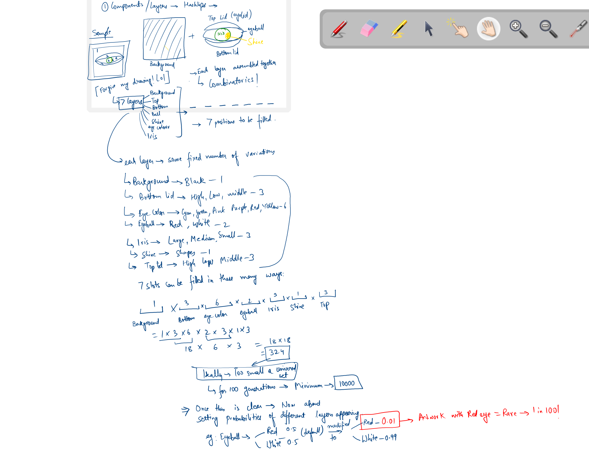

# Arten

## Welcome to Arten

Arten is a single-stop shop for your journey into generative artwork.

I have always been fascinated by the creative process and enamoured by beautiful things. But I never knew how to make those aesthetically pleasing things.

After spending nearly a decade in tech and with the advancements in generative AI, this is my journey into the world of discovering pathways and creating beautiful works of art.

Will this be my life's work? I donot know yet. But that is the answer I am searching for.

Join me!

## Tools

1. Web App related setup - NextJS with Tailwind
2. Generative Artwork Setup
3. Web3 Setup - NFT creation

I will update this page as we move forward.

Let's go!

## Step by step Procedure

1. For the desired artwork, decide on the different components.
   In our example, Hashlips, these are present as layers.
   eg: Background, Eye Ball, Bottom Lid, Top Lid, Iris, Shine,Eye Color
   Refer to the image below for the explanation
   

2. Each layer will have its set of values it can take.
   eg: Background - Black | Eye Ball - Red, White etc

3. Once this is decided, the universal set is created.

4. We need to modify the probabilities of different components taking up different values to decide on distribution of an attribute-value combination appearing in the artwork.
